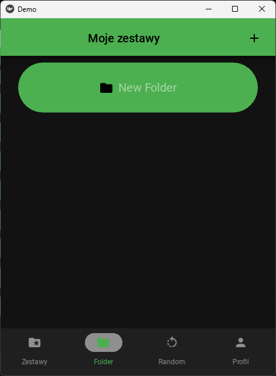

# Fiszki

## Table of contents
* [Description](#description)
* [Technologies](#technologies)
* [Setup](#setup)
* [Screen](#screen)

## Description
An interactive application for learning English, utilizing flashcards to enhance vocabulary and language skills.

## Technologies
List of main technologies used in the project:

- **Frontend**: Kivy, KivyMD
- **Backend**: Django
- **API Framework**: Django Rest Framework (DRF)
- **Authentication**: JSON Web Tokens (JWT)

## Setup

To set up the project locally, follow these steps.

### Requirements

- Python 3.11
- Virtual environment (optional but recommended)

### Installation

1. **Clone the repository:**

   ```bash
   git clone https://github.com/Dzony97/Fiszki.git
   cd Fiszki
   
2. **Create and activate a virtual environment:**
    
    On macOS/Linux:
    
    ```
    python3 -m venv venv
    source venv/bin/activate
    ```

    On Windows:

    ```    
    python -m venv venv
    venv\Scripts\activate
    ```
    Install dependencies:
```pip install -r requirements.txt```

    Run database migrations :
```python manage.py migrate```

    Start the development server :
```python manage.py runserver```

## Screen 

### Create sets to learn new words

<p float="left">
  
  
</p>

### or use ready-made sets and random word sections 

<p float="left">
  
  
</p>

### Learn new words by clicking on a flashcard. Remember the translation and go back to the previous language.

<p float="left">
  
  
</p>

